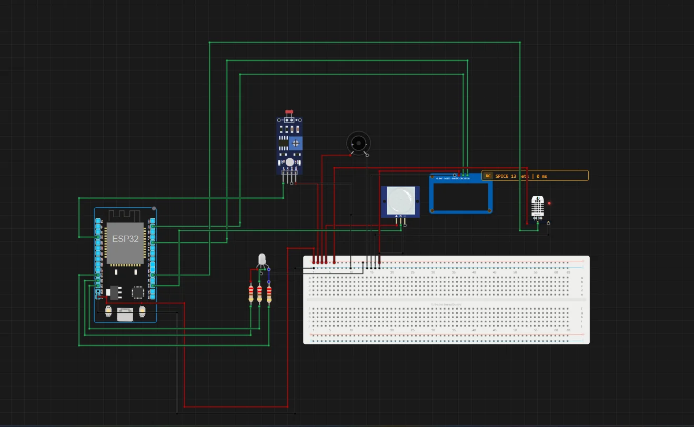

# AllDesk

> Built in [Breadboard](https://breadboard.hackclub.com), a Hack Club program. This project took ~1.3 hours of work.

## What It Does

I think my AllDesk project to give me a best info,this is device have weather,alert system & smart night light tools so I think this is cool project.

## How It Works

The circuit is captured in `breadboard-project.json`, and the firmware that runs it is in the `firmware/` folder.

## How To Use It

I use this my pro my security ,night lighting bestly & every day i see today temp

## Demo

- **Simulate it live:** [https://breadboard.hackclub.com/share/173](https://breadboard.hackclub.com/share/173), runs the firmware in the Breadboard simulator
- **View the design:** [https://taniwankenobi.github.io/breadboard-plays/p/173/](https://taniwankenobi.github.io/breadboard-plays/p/173/)

## Schematic

The editor snapshot is in `breadboard-project.json`.

## Bill of Materials

| Part | Quantity |
| --- | --- |
| breadboard-full | 1 |
| buzzer-passive | 1 |
| dht11 | 1 |
| photoresistor-sensor | 1 |
| pir-motion-sensor | 1 |
| resistor | 3 |
| rgb-led | 1 |
| ssd1306-i2c | 1 |

## Firmware

Firmware files are in the `firmware/` folder.

## Build Journal

Build journal entries are kept in [`journals.md`](journals.md).

---

*Made in [Breadboard](https://breadboard.hackclub.com) — 1.3h of work*

